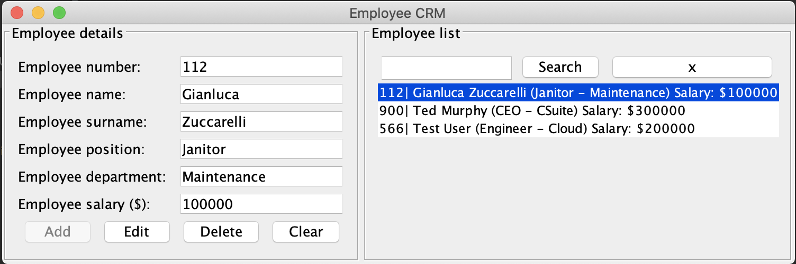
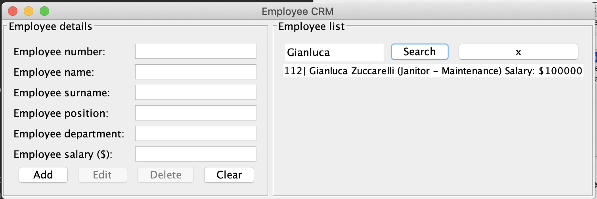

# EmployeeCRM

Distributed systems assignment
The repo for this project can be found on
https://github.com/kingsleyzissou/EmployeeCRM.

## NB

My local database forced me to create a password for the database connection,
otherwise connection to the database was refused. I have set the password to `root`.

Please modify the password field in the `core/DBConnection` class as required.

## Usage

To select an employee, click on the employee in the list on the right hand side. The details will appear in the form and the `Edit` & `Delete` buttons will become available.

The search feature uses predicates to filter through the stored data. The employees are saved to an array list and the filtering takes place on the array list rather than additonal calls to the database, in order to limit the number of database calls. The search functionality works for any of the fields seen in the form and you can search by employee number, name, surname, position deparment or salary.

## Structure

This application makes use of a MVC architecture.

Model - all database queries are run by the model
View - used to display the employee information to the user
Controller - renders the views and supplies the data from the model to the views

## Database

The EmployeeCRM makes use of a mysql database. The table has been given a unqiue name to ensure
no conflicts with other students' projects. The SQL dump is enclosed in this project. The table name is prefixed with my student number.

## GUI

Standard AWT and Swing components were used to create a single window application.

## Error handling

Appropriate error handling has been put into place, including form validation. In terms of UI, a dialog box
is shown to the user to give feedback on the error and a better user experience.
